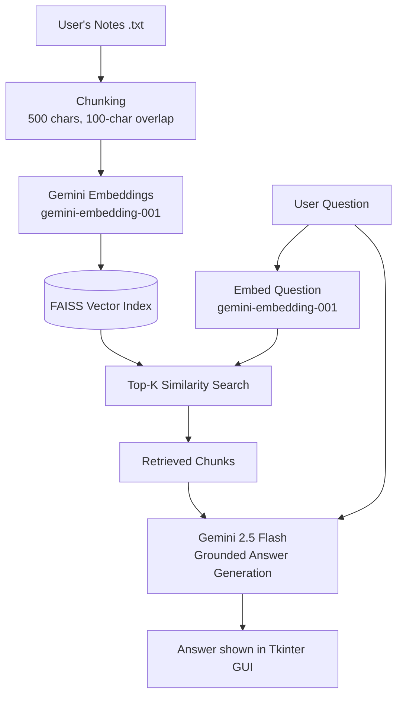

# Simple RAG (Gemini-based) — Notes Study Assistant

A Retrieval-Augmented Generation (RAG) desktop app that answers natural-language
questions **strictly from your own notes** — no hallucinated answers, no
guessing outside the source material.

You upload plain-text notes, ask a question in the GUI, and the app retrieves
the most relevant chunks of your notes and asks Gemini to answer grounded
only in that retrieved context.

---

## Problem Statement

Students often have to read through long documents, lecture notes, or text
files to find specific information or summaries. Reading everything manually
is time-consuming. This project solves this problem with a Retrieval-
Augmented Generation (RAG) system: users upload their text notes and ask
natural-language questions about the material, and the AI retrieves the
most relevant information and formulates an accurate answer based **only**
on the provided notes.

---

## Architecture



**Pipeline, step by step:**

1. **Chunking** — Notes are split into 500-character chunks with a 100-character
   overlap, so context isn't lost at chunk boundaries.
2. **Embedding** — Each chunk is embedded using Gemini's `gemini-embedding-001`
   model and stored in a **FAISS** vector index for fast similarity search.
3. **Retrieval** — When a question comes in, it's embedded the same way, and
   FAISS returns the top-K most similar chunks from the notes.
4. **Grounded generation** — The retrieved chunks + the original question are
   passed to `gemini-2.5-flash`, which is instructed to answer **only** from
   the provided context — reducing hallucination compared to asking the LLM
   directly.
5. **UI** — A lightweight Tkinter desktop GUI lets you load notes, ask
   questions, and see grounded answers in real time.

---

## Tech Stack

| Layer | Tool |
|---|---|
| Language | Python |
| Embeddings | Google Gemini API (`gemini-embedding-001`) |
| Generation | Google Gemini API (`gemini-2.5-flash`) |
| Vector Store | FAISS |
| Numerical ops | NumPy |
| UI | Tkinter |

---

## Setup Instructions

### 1. Clone the repo
```bash
git clone https://github.com/Soumya9173/Simple-RAG-Gemini-based-.git
cd Simple-RAG-Gemini-based-
```

### 2. Create a virtual environment (recommended)
```bash
python -m venv venv
source venv/bin/activate      # Windows: venv\Scripts\activate
```

### 3. Install dependencies
```bash
pip install -r requirements.txt
```

### 4. Get a Gemini API key
Get a free key from [Google AI Studio](https://aistudio.google.com/app/apikey).
You'll enter this directly in the app's GUI — no `.env` file needed.

### 5. Run the app
```bash
python rag_frontend.py
```

In the GUI: enter your API key, select your `.txt` notes file, click
**"Build Index"**, and start asking questions.

---

## Sample Input & Output

**Input document (`sample.txt`):**
```text
Python is a popular programming language.
It is known for simple syntax and readability.
RAG means Retrieval-Augmented Generation.
In a basic RAG pipeline:
1. You load documents.
2. You split them into chunks.
3. You convert chunks to embeddings.
4. You store embeddings in a vector database (like FAISS).
5. For a question, you retrieve relevant chunks.
6. You send retrieved context to an LLM.
7. The LLM generates a grounded answer.
```

**Interaction 1**
- Question: *What does RAG stand for?*
- Retrieved context: "RAG means Retrieval-Augmented Generation..."
- Output: *RAG stands for Retrieval-Augmented Generation.*

**Interaction 2**
- Question: *What are the steps in a basic pipeline?*
- Retrieved context: "In a basic RAG pipeline: 1. You load documents. 2. You split them into chunks..."
- Output: *The steps are: load documents, split into chunks, convert chunks to embeddings, store embeddings in a vector database, retrieve relevant chunks for a question, send retrieved context to an LLM, and the LLM generates a grounded answer.*

**Interaction 3 (out of scope)**
- Question: *What is the capital of France?*
- Output: *I don't know based on the provided document.*

This last case is the point of grounding: the model refuses to answer from
outside the notes instead of hallucinating.

---

## Notable Engineering Decisions

- **Chunk size (500 / 100 overlap)** was tuned to balance retrieval precision
  against context completeness — small enough for precise matches, with
  enough overlap that answers spanning a chunk boundary aren't lost.
- **Deprecated-model handling:** Gemini periodically deprecates model
  versions. The app calls `list_models()` at startup to detect and surface
  this early rather than failing silently mid-query.
- **Quota-aware batching:** Embedding requests are batched to stay within
  Gemini API rate limits instead of firing one request per chunk.

---

## Possible Extensions

- Persist the FAISS index to disk so notes don't need to be re-embedded on
  every run.
- Add PDF/DOCX ingestion in addition to plain text.
- Stream generated answers token-by-token instead of waiting for the full
  response.

---

## License

MIT
